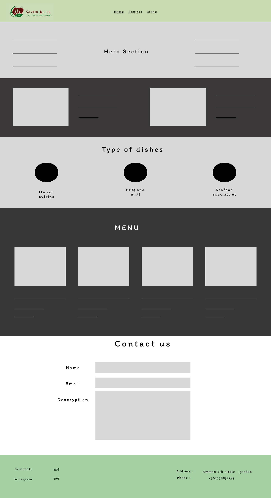

# Savor bites
---
#### this is the wireframe of the resturant i made using figma.
---
## what name did i choose ?
 I chose the name ***Savor Bites***

---
 #### I made some sections in the wireframe such as the following :
 1. header section :
    - Home
    - Contact
    - Menu
2. Hero section :
    - Ther hero section must contain an image with some text to left and right of it to make the website more userfriendly and to show him latest news of my resturant

3. Trending products :
    -  This sections show the most popular sales of the resturant sales per week

4. Type of dishes section :
     the following dishes is being served at the resturant
    - Italian food
    - BBQ and grill
    - seafood
5. Menu section :
    - the menu section provide the user to see the full products which the user can order and every product has it's descryption and price under the image of it
6. contact section:
    - We provide the user our service when he fells unhappy so i created the contact us section only need to type his name and email with the problem he faces.
7. footer:
    - shows our address and phone number in case you want to contact us directly.
---

